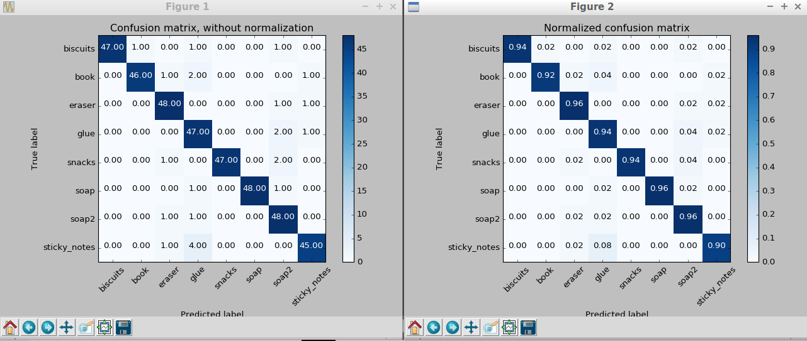

## Project: Perception Pick & Place

---

# Required Steps for a Passing Submission:
1. Extract features and train an SVM model on new objects (see `pick_list_*.yaml` in `/pr2_robot/config/` for the list of models you'll be trying to identify). 
2. Write a ROS node and subscribe to `/pr2/world/points` topic. This topic contains noisy point cloud data that you must work with.
3. Use filtering and RANSAC plane fitting to isolate the objects of interest from the rest of the scene.
4. Apply Euclidean clustering to create separate clusters for individual items.
5. Perform object recognition on these objects and assign them labels (markers in RViz).
6. Calculate the centroid (average in x, y and z) of the set of points belonging to that each object.
7. Create ROS messages containing the details of each object (name, pick_pose, etc.) and write these messages out to `.yaml` files, one for each of the 3 scenarios (`test1-3.world` in `/pr2_robot/worlds/`).  See the example `output.yaml` for details on what the output should look like.  
8. Submit a link to your GitHub repo for the project or the Python code for your perception pipeline and your output `.yaml` files (3 `.yaml` files, one for each test world).  You must have correctly identified 100% of objects from `pick_list_1.yaml` for `test1.world`, 80% of items from `pick_list_2.yaml` for `test2.world` and 75% of items from `pick_list_3.yaml` in `test3.world`.
9. Congratulations!  Your Done!

# Extra Challenges: Complete the Pick & Place
7. To create a collision map, publish a point cloud to the `/pr2/3d_map/points` topic and make sure you change the `point_cloud_topic` to `/pr2/3d_map/points` in `sensors.yaml` in the `/pr2_robot/config/` directory. This topic is read by Moveit!, which uses this point cloud input to generate a collision map, allowing the robot to plan its trajectory.  Keep in mind that later when you go to pick up an object, you must first remove it from this point cloud so it is removed from the collision map!
8. Rotate the robot to generate collision map of table sides. This can be accomplished by publishing joint angle value(in radians) to `/pr2/world_joint_controller/command`
9. Rotate the robot back to its original state.
10. Create a ROS Client for the “pick_place_routine” rosservice.  In the required steps above, you already created the messages you need to use this service. Checkout the [PickPlace.srv](https://github.com/udacity/RoboND-Perception-Project/tree/master/pr2_robot/srv) file to find out what arguments you must pass to this service.
11. If everything was done correctly, when you pass the appropriate messages to the `pick_place_routine` service, the selected arm will perform pick and place operation and display trajectory in the RViz window
12. Place all the objects from your pick list in their respective dropoff box and you have completed the challenge!
13. Looking for a bigger challenge?  Load up the `challenge.world` scenario and see if you can get your perception pipeline working there!

## [Rubric](https://review.udacity.com/#!/rubrics/1067/view) Points
### Here I will consider the rubric points individually and describe how I addressed each point in my implementation.  

---

#### 1. Complete Exercise 1 steps. 

This step involves:

- Noise filtering using `cloud.make_statistical_outlier_filter()`.

- Voxel Grid Downsampling.
- Pass Through Filtering on z and y axis.

- Perform RANSAC plane fitting to segment the table in the scene and extract the outliers which is the object on the table.

#### 2. Complete Exercise 2 steps: 

This step involves:

- Construct a k-d tree from the cloud_objects point cloud.
- Clustering Objects using Euclidean Clustering.

#### 3. Complete Exercise 3 Steps.  Features extracted and SVM trained.  Object recognition implemented.
Generate 50 randomly orienteted object as training data and train the support vector machine on the SVM to classify the trained clusters.

Accuracy: 0.94 (+/- 0.05) 

Accuracy score: 0.94

Here is the example of the final clustered and classified objects:

### 4. Calculate the center of each detected object and output .yaml files.

- Iterate through the `object_list_param` and `object_list `
-  Check if the label matches or not
-  If yes, assign the proper left or right to arm_name 
-  Store the `yaml_dict` list and save it.

### Discussion
This project integrate a whole process of perception. We need to deal with noise and downsample the dataset, isolate the objece of interest, extract features from each of the object, use machine learning classified to identify each object and label them. Finally we calculate the position of each cluster and decide which arm based on the yaml file.

One thing I would dig deeper is how to achieve the building of the collision map by rotating PR2 in place to capture side tables. Also the path calculatd after `pick_place_routine(test_scene_num, object_name, arm_name, pick_pose, place_pose)` seems too big in z axis that it failed on grabbing the object.

